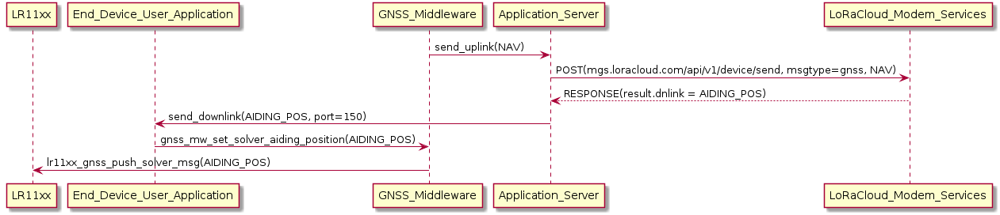

Application server for Geolocation
==================================

.. _Application Server Introduction:

Introduction
------------

The geolocation middleware described in this project relies on an application server to provide the final location.

As the end-device using the LR11xx radio does not provide the location on itself, it requires some assistance. But it does not require the same level of assistance if it uses GNSS or Wi-Fi scanning.

.. _Requirements on the Application Server for GNSS geolocation:

Requirements on the Application Server for GNSS geolocation
-----------------------------------------------------------

In order to be able to detect Space Vehicles (SVs) and generate a NAV message to be sent to the GNSS solver, using GNSS assisted scan, the LR11xx radio needs the following:

* the current time/date
* an almanac up-to-date
* an assistance position close enough to the actual position (~150 km)

.. _time and almanac:

Time & Almanac update
+++++++++++++++++++++

The middleware itself does not handle time synchronization and almanac update. It is up to the user application to use the services provided by the LoRa Basics Modem and its connection to LoRaCloud "Modem and Geolocation Services".

Once the end-device has configured the LoRa Basics Modem services, it is up to the Application Server to forward the Device Management messages received on port 199 to the LoRaCloud Modem Services, and transmit back to the end-device the downlink responses if any.

.. _assistance position:

Assistance Position update
++++++++++++++++++++++++++

When the GNSS solver detects that the assistance position used by the LR11xx radio is not accurate anymore compared to the solved position it provides a new assistance position to be sent to the LR11xx radio.
It is the responsibility of the Application Server to get this assistance position from LoRaCloud Geolocation Service and forward it to the end-device as an applicative downlink.

The user application on the end-device must forward the downlink received from the Application Server to the middleware, using the ``gnss_mw_set_solver_aiding_position()`` API function.

.. _fig_docApplicationServerAssistancePosition:

   Application Server assistance position

It is to be noted that the payload sent by LoRaCloud can be forwarded "as is" to the middleware.

In order to get an update of the assistance position from the solver, the NAV message has to be sent to the "Modem Services" API (``mgs.loracloud.com/api/v1/device/send``), with ``msgtype`` set to ``gnss``.

A description of the API can be found here: https://www.loracloud.com/documentation/modem_services?url=mdmsvc.html#uplink-message

(The multiframe solver API from the "Geolocation Services" (``mgs.loracloud.com/api/v1/solve/gnss_lr1110_multiframe``) won't provide an update of the assistance position.)

.. _GNSS multiframe solving:

GNSS Multiframe solving
+++++++++++++++++++++++

In order to improve the accuracy of GNSS solving, it is recommended to use the multiframe solving of the LoRaCloud "Geolocation Services".

The GNSS middleware helps for gathering NAV messages that should be used together for a multiframe solving by adding "scan group" information with the NAV message.

A *scan group* is a collection of successive GNSS scan results. Each element of a scan group contains:

- NAV message;
- **group token** (7 bits); and
- **last NAV message** (1 bit).

All items belonging to the same group have the same **group token** value. The **last NAV message** bit of an element is set when it is the last element of the group being send.

To take into account the fact that any uplink can be lost over-the-air, the Application Server shall implement the following process to handle multiframe solving:

- On reception of a new scan group item, store it and:

  - if the last item received has **last NAV message** bit set: the current scan group is terminated and a multiframe request can be prepared.
  - if the last item received has a **group token** value that is different from the one before: the last item of the previous scan group has been lost over-the-air, and it is terminated. A multiframe request of the previous scan group can then be prepared.
  - the last item received has a **group token** value that is different from the one before and it has **last NAV message** bit set: the previous scan group has terminated and the one being received also. A multiframe request for the previous scan group can be prepared, and a second GNSS solving request can be prepared for the last item received. Here the second request will contain only one NAV message (single frame request).

The preparation of multiframe request is described here: https://www.loracloud.com/documentation/modem_services?url=gls.html#apiv1solvegnssmulti. The multiframe request shall contain NAV messages of all items belonging to the same scan group.

.. _Requirements on the Application Server for Wi-Fi geolocation:

Requirements on the Application Server for Wi-Fi geolocation
------------------------------------------------------------

The end-device do not need valid time nor assistance position to perform Wi-Fi solving. Therefore it can start Wi-Fi scanning as soon as it has joined the network.

The Application Server just has to build the POST request for LoRaCloud "Modem Services" with the MAC addresses received in the uplink, using the ``msgtype`` seto to ``wifi``.

A description of the API can be found here: https://www.loracloud.com/documentation/modem_services?url=mdmsvc.html#uplink-message

As the middleware does not add the RSSI of the MAC addresses detected, this format can be used for solving: https://www.loracloud.com/documentation/modem_services?url=mdmsvc.html#record-wifilocmac

Application Server block diagram
--------------------------------

This diagram is a simplified view an implementation of the application server, aiming to show the different LoRaCloud APIs to be used.

.. _fig_docApplicationServerBlockDiagram:

.. figure:: geoloc_docApplicationServerBlockDiagram.png
   :align: center
   :alt: application server block diagram

   Application Server Block Diagram
